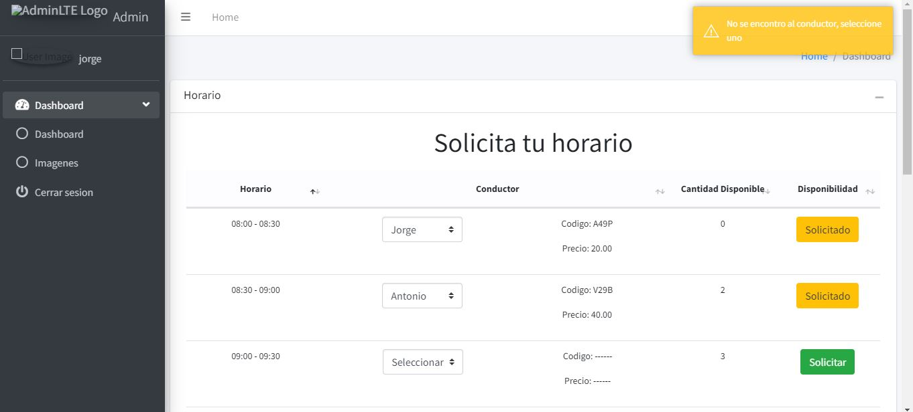
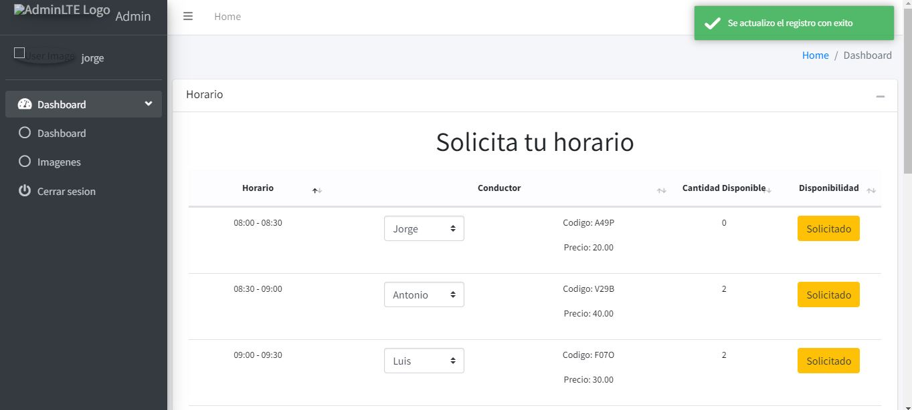

# Sistema-Uber-servicio-de-motocicleta-POO-MVC
Este proyecto trata de solicitar el servicio de una o varias motos en un horario en particular, primero se tiene que loguear con un usuario y clave, si el usuario existe, tiene que ser otro usuario. Una vez dentro el usuario solicita una moto, la cantidad disponible para cada horario es de 3 motos, cuando selecciona en 'Solicitar' (se tiene que seleccionar un Conductor) el boton cambia a solicitado  y la cantidad disponible disminuye en 1, y si ya no desea en ese horario selecciona el mismo boton y se cambia a 'Solicitar' y la cantidad disponible aumenta en 1. El usuario puede solicitar el servicio en cualquier horario y la cantidad de motos que desee. Una vez que un horario(ejm: 08:00 - 08:30) este solicitado las 3 motos, la cantidad disponible para otro usuario no esta disponible y se bloquea el boton hasta que algun usuario que haya solicitado en ese horario cambie de opcion. El proyecto esta hecho con PHP, MYSQL, JS nativo AJAX, BOOTSTRAP, CSS3 Y HTML5. Se utilizo Ajax para escoger al conductor, tambien el login tiene validaciones tanto en el Backend como el Frontend.

#### usuario: jorge - contraseña: 1234
#### usuario: marco - contraseña: 1234
#### uuario: otro - contraseña: 1234
#### uuario: luis - contraseña: 1234

#### En la siguiente imagen se muestra al usuario Jorge, solictando un horario, pero no escogio un conductor en el horario (09:00 - 09:30) y le manda una alerta

#### En la siguiente imagen se muestra al usuario Jorge, solicitando y guardando el registro

